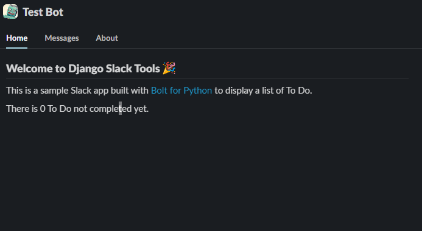
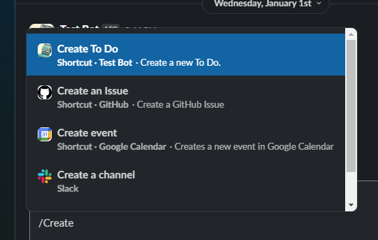
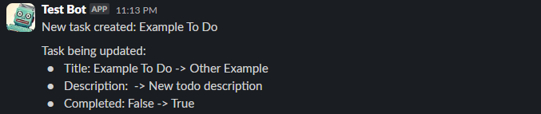

# Example To Do app

Simple To Do bot example with Django Slack Tools.

This is simple and boring demo application. I'm planning to bring some more useful and interesting example in future!

## Features

- Show recent To Do from app home

- Create or mark it done a To Do from Slack shortcuts via modals

- Notify to Slack channel if To Do created or updated using Django signals

## Create Slack app

This example uses event subscription and messaging features. As Slack documentation suggest, We'd recommend to use ngrok for it. See [link](https://api.slack.com/start/building/bolt-python).

Required scopes to bot fully work (including admin pages):

- **app_mentions:read**
- **channels:read**
- **chat:write**
- **chat:write.customize**
- **commands**
- **team:read**
- **usergroups:read**
- **users:read**

## Run application

Copy `.env.example` file as `.env` and update values first.

```
SLACK_BOT_TOKEN='xoxb-...'
SLACK_SIGNING_SECRET='...'
```

Before proceed, open `dump.json` file and replace value `"<UPDATE-ME>"` to channel ID you want to receive messages.
Bot should be in the channel with you to receive messages.

Then, follow:

```bash
# Shortcut script to install deps, run DB migration and create superuser, load initial data, etc.
# Once finished, superuser with username `"admin"` and `"admin"` created.
$ make setup

# Run Django web server and database / message broker.
# Go to http://localhost:8000/admin to visit admin page.
$ make run

# (Optional) To test full functionality, create new terminal and run Celery worker
$ make run-celery-worker

# (Optional) To test periodic tasks, create another new terminal and run Celery Beat scheduler
$ make run-celery-beat
```

Once server started, open a new terminal and run ngrok for event subscription.

```bash
# Add auth token for ngrok if not set yet
$ ngrok config add-authtoken '...'

# Run ngrok server (with free static domain for later re-run) to get Slack events
$ ngrok http 8000 --domain '....ngrok.free.app'
```

Go to the Slack bot settings and configure event subscription with given ngrok URL. If you are seeing 401 errors in ngrok traffic logs, check your bot credentials.

Once all setup is done, you will see bot homepage like this:



And shortcuts available in Slack chat if you type slash(/):



Create and update To Do object to see messages.


